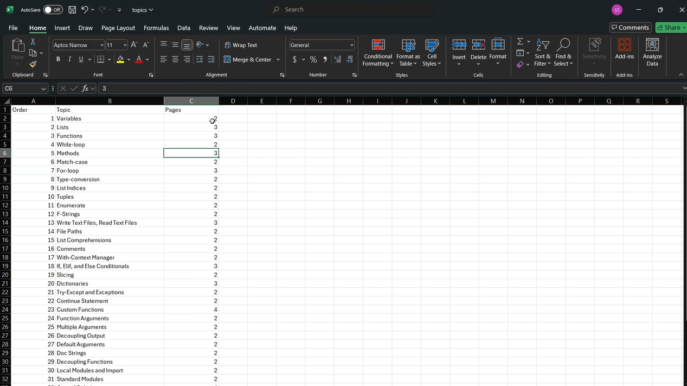
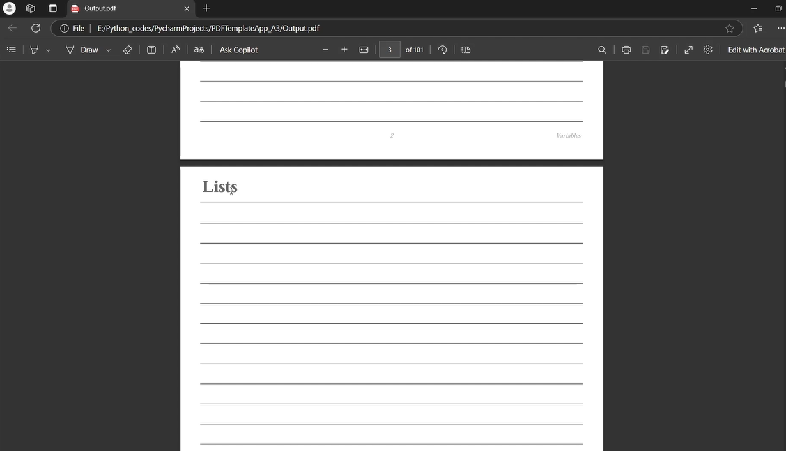

# 📄 PDF Template App

A Python application that generates a multi-page PDF template with topics and line guides. This project uses the **FPDF** library to create structured PDFs with dynamic content and pagination.

---

## 🛠️ Features

- **Dynamic Content**: Generates PDF pages based on topics from a CSV file.
- **Line Guides**: Adds horizontal lines to each page for writing or note-taking.
- **Pagination**: Automatically numbers pages and includes topic names in the footer.
- **Customizable**: Easily modify the CSV file to add or remove topics.

---

## 🚦 How to Use

1. Install the required dependencies (`pandas` and `fpdf`).
2. Update the `topics.csv` file with your desired topics and the number of pages for each topic.
3. Run the script to generate the PDF template.

---

## 📸 Screenshots

---

## 🎥 Demo

---

## 📬 Contact

Feel free to explore the project and share your feedback. For any inquiries, suggestions, or contributions, reach out to me at **sathiyanarayanan.s1698@gmail.com**.
